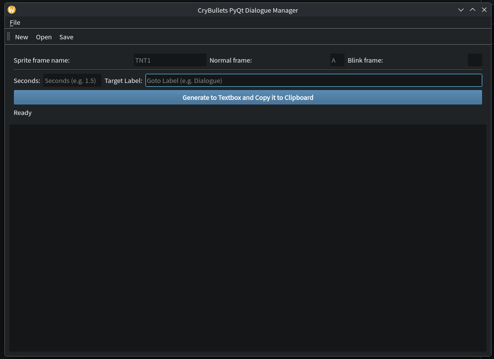
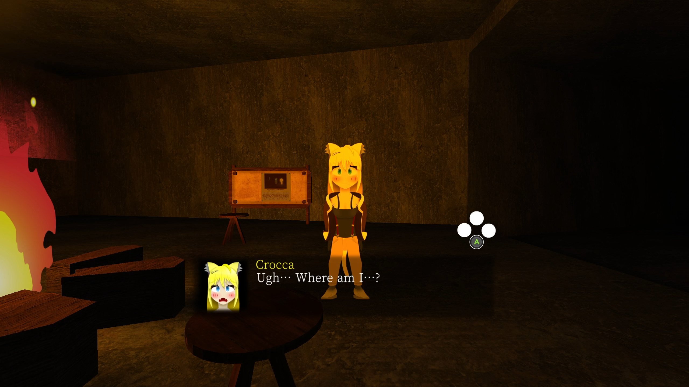

# Crystalled Bullets Dialogue Manager

A Dialogue Manager intented to be used in Crystalled Bullets.
Written in PyQt6.

# Screenshots

 
 

## Features

- Generates appopriate ZScript depends on voice line's seconds length.
- Small Text Editor jointed on bottom.
- Skippable Text by Jump Button.
- Generates blink animation (optional, only if entered blink animation.)

## ToDo

- Support for lip sync animation.
- GUI Editor for "TNT1 A 0 CB_SpeakDialogue"

## Contributing

Contributions are welcome! If you have ideas or improvements, feel free to fork the repo and submit a pull request. For major changes, please open an issue first to discuss what you'd like to change.
