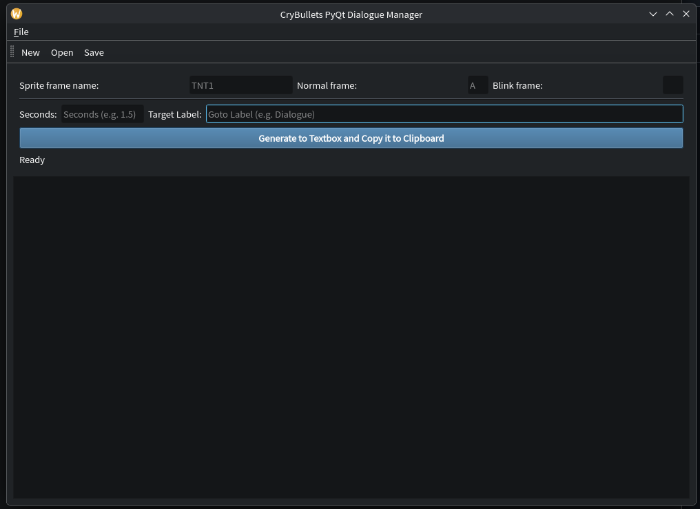
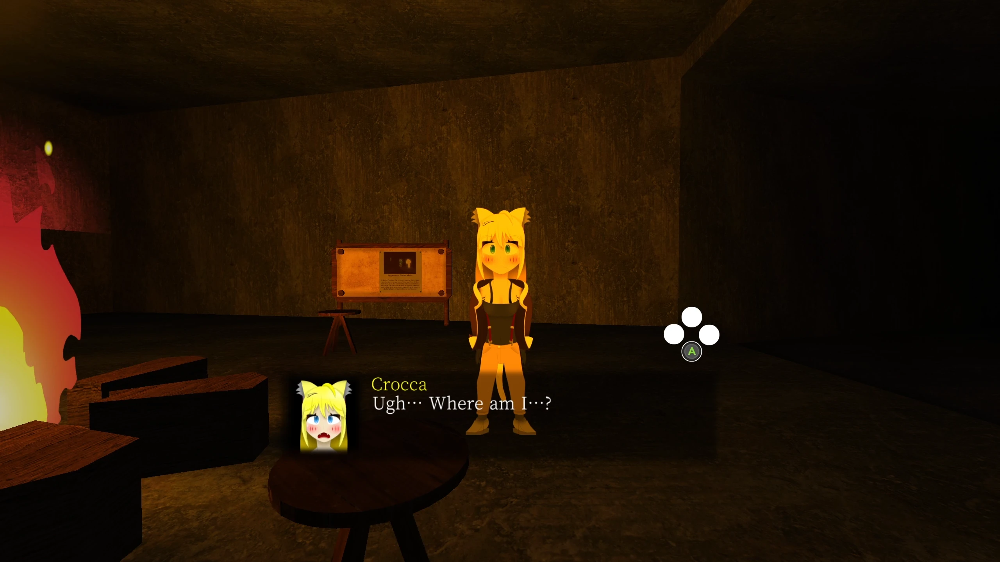

# Crystalled Bullets Dialogue Manager

A Dialogue Manager intented to be used in Crystalled Bullets.
Written in PyQt6.

# Screenshots

 
Note: The GUI of application screen shot is now very outdated. By the time I finishes the app to be anywhere useable, then I can finally update it.

 

## Features

- Generates appopriate ZScript depends on voice line's seconds length.
- Small Text Editor jointed on bottom.
- Skippable Text by Jump Button.
- Generates blink animation (optional, only if entered blink animation frame.)
- Generates Lip Sync Animation when user loaded audio file.
- Detection of audio where voice actor is screaming or speaking normally via Unperiodic movement of the wave

## ToDo

- GUI Editor for "TNT1 A 0 CB_SpeakDialogue"
- Support other audio format other than .ogg. such as .mp3 or .wav
- Rewritten of audio file analysis program to be ran on C/C++ for better peformance. (Not so high priority)

## Contributing

Contributions are welcome! If you have ideas or improvements, feel free to fork the repo and submit a pull request. For major changes, please open an issue first to discuss what you'd like to change.

## Tech Stacks
- Python (obviously)
- ffmpeg
- The framewrok to run Qt application

The very last one should be pre-installed on your Linux distro or Arch user using KDE Plasma.
Packages below are Python packages. Please install them via "pip" for Windows, or your Linux distro package managers. (I use Arch Linux, thus please use pacman and AUR package manager to do that.)

- PyQt6
- Mutagen
- NumPy
- pydub
- SciPy

If you want run this application on your system, please install the required dependencies.
Currently, only Linux is supported. And since It's generic Python app, it should have works with Windows, but I have no idea how to run it on Windows machines. Due to lack of experience with Python and Windows.

## Licences

Licence of this very own program(Python) is **GPL3** Licenced. Thus, please follow GPL3's basic rules of copyleft when you're redistribute or modify it. 
However, the dialgoue code(ZScript) generated with this program is belong to yours. Feel free to use it to your Crystalled Bullets mod, as well as Doom mods or commercial ZDoom game for your needs.
