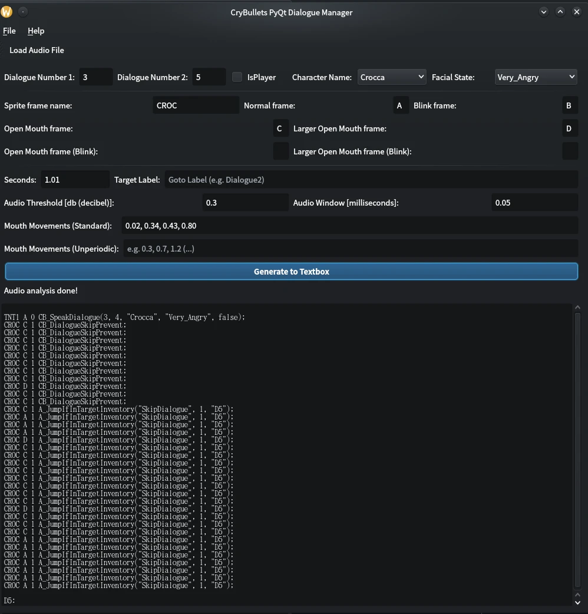

# Crystalled Bullets Dialogue Manager

Crystalled Bullets Dialogue Manager is the development assist tool for my video game, Crystalled Bullets.<br>
This is dialogue manager intented to be used in Crystalled Bullets to help making cutscenes easier.<br>
Written in Python.

# Screenshots

 
Screenshot taken on Arch Linux running on KDE Plasma 6.7.1 with Oxygen Theme

Note: The app is active development. as such, this GUI of application screen shot can be outdated.

Lip Sync Video Demo:
[](https://github.com/DeadRuins/CryBullets-Dialogue-Manager/blob/main/screenshots/LipSync%20Demo%20LQ.mp4)

## Features

- GUI Editor for "CB_SpeakDialogue"
- Generates appopriate ZScript depends on voice line's seconds length.
- Small Text Editor jointed on bottom.
- Skippable Text by Jump Button.
- Generates blink animation (optional, only if entered blink animation frame.)
- Generates Lip Sync Animation when user loaded audio file.
- Detection of audio where voice actor is screaming or speaking normally via Unperiodic movement of the wave.

## ToDo

- Better lip sync algorithm accuracy: Currently often mispick ups, or forgotten to pick ups due to volume difference within the waves audio file itself.<br>
    → Fixing idea 1. Limit picking up a audio wave from 300-3400 [Hz] via High (and Low) Pass Filter.<br>
    → Fixing idea 2. does a little thing with increasing a volume of a whole sound when its not loud enough.<br>

- Support other audio format other than .ogg. such as .mp3 or .wav (Again, not so high priority.)
- Rewritten of audio file analysis program to be ran on C/C++ for better peformance. (Not so high priority)

## Contributing

Contributions are welcome! If you have ideas or improvements, feel free to fork the repo and submit a pull request. For major changes, please open an issue first to discuss what you'd like to change.

## Tech Stacks
- Python (obviously)
- ffmpeg
- The framewrok to run Qt application

The very last one should be pre-installed on your Linux distro or Arch user using KDE Plasma.
Packages below are Python packages. Please install them via "pip" for Windows, or your Linux distro package managers.<br> 
For example, I use Arch Linux, thus use pacman and/or AUR package manager to install new packages via this command like this:

```bash
sudo pacman -S python-pyqt6 python-mutagen python-numpy python-pydub python-scipy ffmpeg
```

- PyQt6
- Mutagen
- NumPy
- pydub
- SciPy

If you want run this application on your system, please install the required dependencies.
Currently, only Linux is supported. And since It's generic Python app, it should have works with Windows, but I have no idea how to run it on Windows machines. Due to lack of experience with Python and Windows.

## Licences

Licence of this very own program(Python) is **GPL3** Licenced. Thus, please follow GPL3's basic rules of copyleft when you're redistribute or modify it. 
However, the dialgoue code(ZScript) generated with this program is belong to yours. Feel free to use it to your Crystalled Bullets mod, as well as Doom mods or commercial ZDoom game for your needs.
